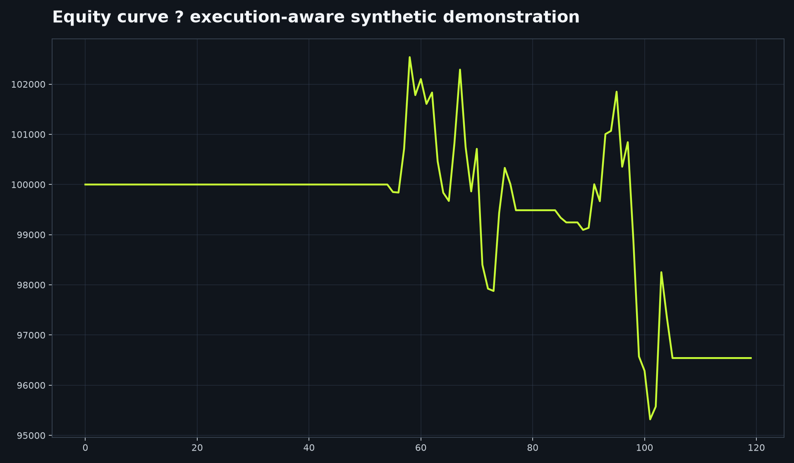

# Quant Backtesting Engine

[Live dashboard](https://quant-backtesting-engine.vercel.app)

The public dashboard downloads adjusted historical closes for the requested ticker and interval. It never substitutes generated prices. Eleven strategies are available: SMA, EMA, RSI, MACD, Bollinger, Donchian, price momentum, dual momentum, z-score mean reversion, volatility-filtered trend, and buy-and-hold.



A modular Python backtester that makes execution assumptions, costs, and signal timing explicit.

## Features

- SMA crossover and RSI mean-reversion strategies
- Next-bar execution through signal shifting; configurable fractional sizing, commission, and slippage
- Equity curve, trade ledger, drawdown, annualized return, volatility, Sharpe, Sortino, and Calmar metrics
- yfinance data loader with deterministic, API-free tests

## Architecture

`strategies -> shifted signal -> execution engine -> equity/trades -> metrics`

## Install and run

```bash
python -m venv .venv
.venv/Scripts/pip install -e . pytest ruff
python -m backtesting_engine run --ticker AAPL --strategy sma-crossover --start 2020-01-01 --end 2025-01-01
```

## Quality checks

```bash
ruff check .
ruff format --check .
pytest
```

## Data, output, and troubleshooting

The command retrieves adjusted historical bars with yfinance and writes the result to stdout; it does not submit any orders. Use valid exchange symbols and an end date after the start date. If data is empty, confirm the ticker and retry later because yfinance can be delayed or temporarily unavailable. Start with a short period when diagnosing setup issues, then use a longer, fixed period for comparable research.

Signals are shifted to next-bar execution deliberately: changing that timing changes the backtest and can introduce look-ahead bias. Review the trade ledger, costs, slippage, drawdown, and annualization assumptions before comparing strategies. The test suite uses deterministic local inputs and does not require a data-provider key.

## Assumptions and limitations

Orders are sized and filled at the next available bar close. This compact research engine does not model intraday liquidity, corporate actions beyond adjusted prices, or portfolio-level margin.

## Financial disclaimer

This project is intended for educational and research purposes only. It does not provide investment advice, and its outputs should not be used as the sole basis for financial decisions. Historical performance does not guarantee future performance.

MIT License. Author: Aarav Shah.
